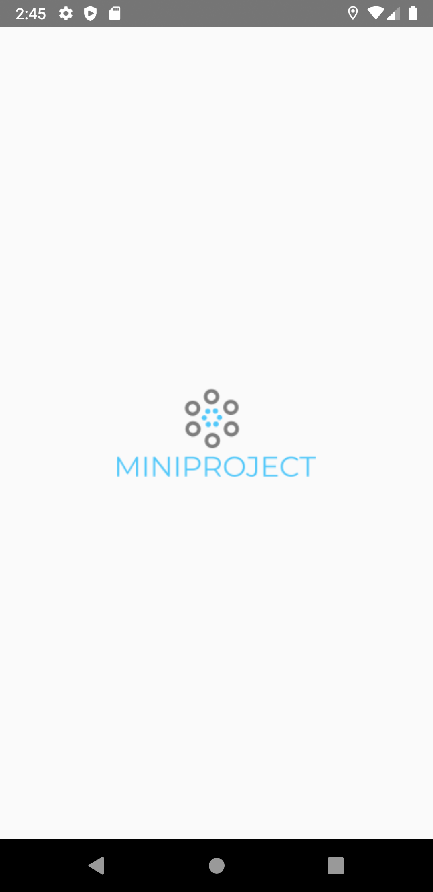
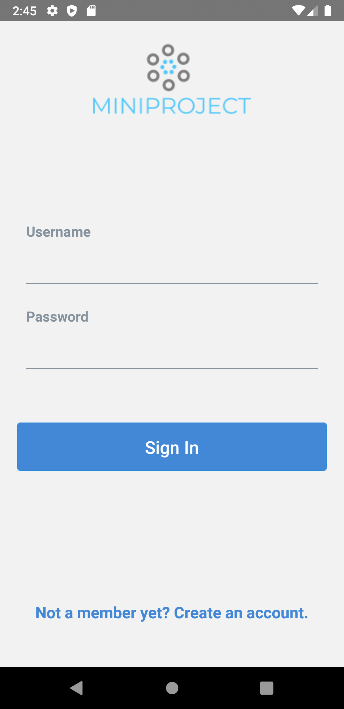
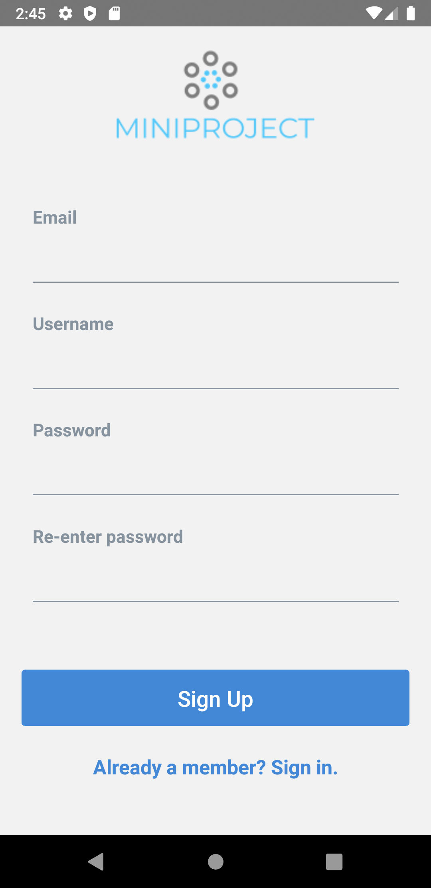
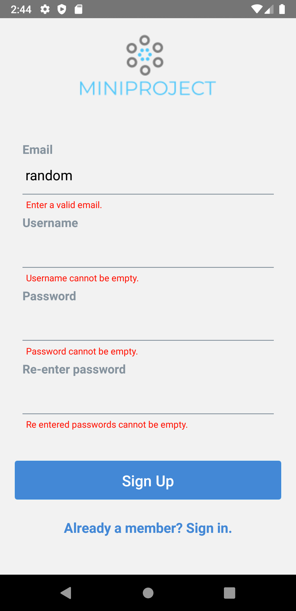

# Splash, Login and Sign up Screens

Created a react-native project that has 3 screens: Login Screen, Signup Screen and Splash Screen. Error validation is done in the Sign up Screen. This is a sample front-end project with no backend to validate Login.

## React native Concepts

- Styling of Input and Button containers and placement of them in the screens.
- Use of a third party react-native-elements module inside the project.
- Use of hooks to store the data and do validation.
- Clean and functional code with proper seperation of code.

## Splash Screen

## Login Screen

## Signup Screen

## Signup Screen with validation

